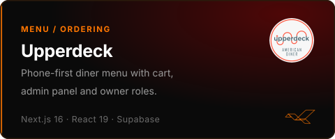
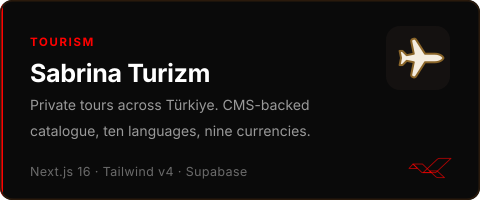
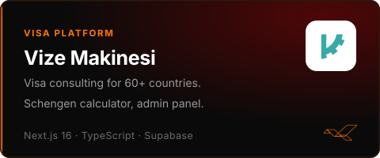
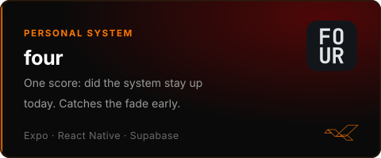

  

 

I'm a senior associate at **Kagu Software**, an Istanbul-based studio building operator software
for small businesses — booking systems, tills, kitchen displays, stock and back-office.
Mostly TypeScript: Next.js and React on the web, Expo on mobile, Electron on the counter,
Supabase underneath. The kind of software that has to still work at 9pm on a Friday.

 

## Selected work

<table>
  <tr>
    <td width="50%"></td>
    <td width="50%"></td>
  </tr>
  <tr>
    <td width="50%"></td>
    <td width="50%"></td>
  </tr>
</table>

More of what we build at [github.com/KaguSoftware](https://github.com/KaguSoftware).

 

## How I build

**Web**: Next.js (App Router), React 19, TypeScript, Tailwind, Vite for the operator SPA

**Mobile**: Expo, React Native, shipped to iOS and Android

**Desktop**: Electron, better-sqlite3, ESC/POS thermal printing, LAN kitchen display

**Backend**: Supabase, Postgres, row-level security, one database behind every surface

**Ship**: Vercel, GitHub, pnpm workspaces and Turborepo, Playwright before release

 

## Let's talk

Building operator software out of Istanbul at Kagu Software, alongside
[@ParSaMnSS](https://github.com/ParSaMnSS).

If you run a venue and your software fights you , I'd like to hear about it.

Istanbul · UTC+3 · every graphic on this page is hand-written SVG.
